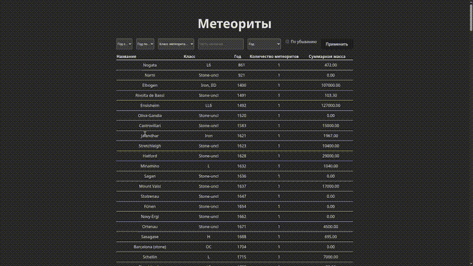

# TestMeteorApi — тестовое задание

> **Кратко:** сервис, который раз в расписание загружает JSON с внешнего URL (набор данных метеоритов), сохраняет/обновляет записи в базе, и предоставляет HTTP API + простую страницу для фильтрации/группировки/сортировки.

---

## Содержание

* GIF-демо
* О проекте
* Быстрый старт
* Архитектура и дизайн решений
* Работа с миграциями (трешинг / распространённая проблема на Arch Linux)
* Как запустить периодическую задачу
---


## GIF-демо

Демонстрация работы



---

## О проекте

Реализация тестового задания: загрузка JSON по адресу:

`https://raw.githubusercontent.com/biggiko/nasa-dataset/refs/heads/main/y77d-th95.json`

Сервис периодически (по расписанию) загружает данные, сравнивает с тем, что в БД, и применяет insert/update/delete таким образом, чтобы в базе отражалось текущее состояние источника. Также реализован API-метод для выборки данных с поддержкой фильтров (диапазон лет, типом, часть названия), группировки по году и сортировки (год, количество, суммарная масса). Есть простая фронтенд-страница, которая обращается к API и показывает таблицу с сортировкой по колонкам.

---

## Быстрый старт

> Предположим, у вас установлен .NET SDK (9.0+), и поднята СУБД (Postgres/MSSQL/SQLite — в конфиге укажите строку подключения).

1. Клонируйте репозиторий

```bash
git clone https://github.com/XTheTap/TestMeteorApi.git
cd TestMeteorApi
```

2. Настройте строку подключения (игнорируйте если будете использовать ту же базу что и в репо в том же контейнере):

```json
{
  "ConnectionStrings": {
    "DefaultConnection": "Host=localhost;Port=5432;Database=testmeteor;Username=user;Password=pass"
  }
}
``` 

3. Запустить docker-compose (поднимет БД и приложение):
```
docker-compose up --build
```

4. Примените миграции вручную (если не применилась автоматически):

```bash
cd src/YourApiProjectFolder
dotnet ef database update --project . --startup-project .
```

5. Откройте страницу в браузере: `http://localhost:5000` (или порт, указанный в логах).

---

## Работа с миграциями (возможная проблема: "на Arch миграция не применяется автоматически")

### Что обычно происходит

При первом запуске код иногда запускает `dbContext.Database.Migrate()` автоматически из Startup/Program. На некоторых системах (особенно на Linux-дистрибутивах с нестандартной конфигурацией, вроде Arch) автоприменение миграций может не сработать из-за:

* отсутствия dotnet-ef или прав на выполнение
* несовпадения провайдера БД (например, используете SQLite локально, а в конфиге пустой connection string)
* различий в окружении и переменных среды

### Рекомендации

1. **Применяйте миграции вручную** (самый надёжный путь):

```bash
# из корня проекта (или укажите путь к проекту)
dotnet ef database update --project src/YourApiProjectFolder --startup-project src/YourApiProjectFolder
```

Если `dotnet ef` недоступен, установите его, как показано в разделе "Быстрый старт".

2. **Проверьте строку подключения** — убедитесь, что приложение и `dotnet ef` используют одну и ту же конфигурацию/переменные окружения.

3. **Логи** — включите подробные логи для EF и провайдера БД, чтобы увидеть причину отказа.

4. **Права** — если база требует суперпользовательских прав для создания БД/схемы, убедитесь, что у вас есть нужные права.

5. **Systemd/SELinux/AppArmor** — если приложение запускается как сервис, права могут отличаться от локального запуска.

6. **Специально для Arch**: нет единой универсальной проблемы, но часто пользователи забывают экспортировать переменные окружения в systemd unit, или `dotnet-ef` не установлен глобально в том же окружении, где запускается сервис.

---

## Как запустить периодическую задачу

В проекте есть пример фоновой службы на основе `IHostedService` (или использован Quartz.NET). Коротко:

* Используйте CRON-строку для вычисления расписания.
* Запускайте job, который делает: `GET` внешнего JSON → десериализация в DTO → вызов сервиса синхронизации.
* Всю работу оборачивайте в `try/catch`, логируйте ошибки и метрики (кол-во вставок/обновлений/удалений, длительность).

---
